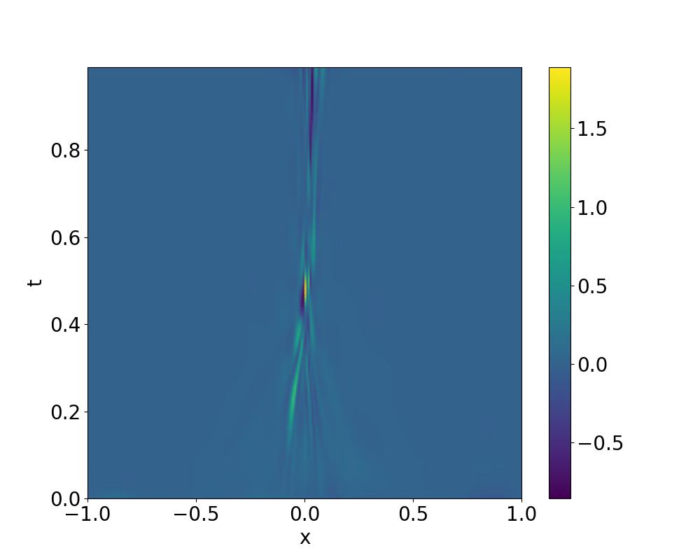

# Paddle 论文复现挑战赛第七期
—— 科学计算方向 51

原文：[Gradient-enhanced physics-informed neural networks for forward and inverse PDE problems](https://doi.org/10.1016/j.cma.2022.114823)

参考：[GPINN](https://github.com/lu-group/gpinn)

- 近年来，大量文献研究表明PINN通过将PDE残差嵌入神经网络的损失函数中可以成功解决各类正向和反向问题。但是，即使采用在求解域充分的采样点，其准确度仍有限。因此，该文章提出了一种具有梯度增强的物理知识融合网络GPINNs，同时提高训练效率和网络准确性。

- 在GPINNs的实现过程中，作者将PDE残差的梯度信息作为一个加权损失函数补充训练。相对于传统的PINNs，作者处理的技巧主要包括了两点（GPINNs——Gradient-enhanced physics-informed neural networks）：

  - 在损失函数设计，GPINNs引入了PDE残差对各个自变量的梯度残差损失，并采用加权损失函数。
  - 所有问题中均引入了[hard constraints](https://epubs.siam.org/doi/10.1137/21M1397908)约束神经网络输出，使得边界条件和初始条件天然满足，降低了神经网络优化的难度。
  - 在训练过程中，先以大量的残差样本点作为初始训练集，在训练过程中，通过不断寻找PDE残差较大的区域进行重采样进行补充训练集——即类似主动学习的策略对PINNs进行训练。


## 2.代码说明

1. [gPINNs4paddle AI studio](https://aistudio.baidu.com/aistudio/projectdetail/4493662)相关运行结果

  - 脚本文件包括

    - run_3.2.1.py、run_3.2.2.py——实际对应原文中3.2部分代码。
    - run_3.3.1.py、run_3.3.2.py——实际对应原文中3.3.1部分代码。
    - run_3.4.1.py、run_3.4.2.py——实际对应原文中3.4部分代码。
    - 其中每个脚本都进行了如下的参数设置：

    ```python
    def get_args():
        parser = argparse.ArgumentParser('PINNs for Poisson2D', add_help=False)
        parser.add_argument('-f', type=str, default="external")
        parser.add_argument('--net_type', default='gpinn', type=str)
        parser.add_argument('--epochs_adam', default=20000, type=int)
        parser.add_argument('--save_freq', default=5000, type=int, help="frequency to save model and image")
        parser.add_argument('--print_freq', default=1000, type=int, help="frequency to print loss")
        parser.add_argument('--device', default=True, type=bool, help="use gpu")
        parser.add_argument('--work_name', default='Poisson-2D', type=str, help="save_path")
    
        parser.add_argument('--Nx_EQs', default=100, type=int)
        parser.add_argument('--Nt_Val', default=100, type=int)
        parser.add_argument('--Nx_Val', default=100, type=int)
        parser.add_argument('--g_weight', default=0.01, type=float)
        return parser.parse_args()
    
    ```

    其中，net_type可供选择采用gPINN模式或pinn模式；

    epochs_adam为采用adam优化器进行训练的总步数；

    save_freq、print_freq为打印残差以及输出中间可视化结果的频率；

    device为是否使用gpu并行；

    work_name为保存路径。

    Nx_EQs为训练PDE残差的采样点个数；

    Nt_Val、Nx_Val分别指代采用验证数据时在时间t（如果存在）以及x方向的采样点个数（均匀网格）；

    g_weight为gradient ehanced的残差权重，即下式的$w_{g_i}$。
    $
    \mathcal{L}=w_f \mathcal{L}_f+w_b \mathcal{L}_b+w_i \mathcal{L}_i+\sum_{i=1}^d w_{g_i} \mathcal{L}_{g_i}\left(\boldsymbol{\theta} ; \mathcal{T}_{g_i}\right)
    $
    其中，$L_f、L_b、L_i$为PDE残差、边界条件、初始条件损失，权重均默认为1，后两者由于采用了hard constraints因此均为0。

  - **fig文件夹**中为原始论文结果相关图片以及作者复现所整理的对应结果，**work文件夹**中为训练过程及中间结果

    - Poisson-1D为3.2.1中算例对应结果文件存放位置，用于绘制Figure2。
    - Poisson-2D为3.2.2中算例对应结果文件存放位置，用于绘制Figure3。
    - Brinkman-Forchheimer-1为3.3.1中算例对应结果文件存放位置，用于绘制Figure 6，反问题中预测一个参数。
    - Brinkman-Forchheimer-2为3.3.1中算例对应结果文件存放位置，用于绘制Figure 7，反问题中预测二个参数。
    - Buergers-2D为3.4中算力对应结果文件存放位置，用于绘制Figure 10、11、12。

  - basic_model.py 中为实现的全连接神经网络结构

  - process_data.py 中为求解域离散点采样方法

  - visual_data.py 为训练过程的数据可视化

## 3.环境依赖

  > numpy == 1.22.3 \
  > paddlepaddle-gpu develop \
  > matplotlib==3.5.1 \
  > seaborn==0.11.2 

## 4.复现结果

### 4.1 正向问题 

1).原始方程为1-D Poisson方程：
$
-\Delta u=\sum_{i=1}^4 i \sin (i x)+8 \sin (8 x), \quad x \in[0, \pi]
$
方程解析解为
$
u(x)=x+\sum_{i=1}^4 \frac{\sin (i x)}{i}+\frac{\sin (8 x)}{8}
$
损失函数为
$
\mathcal{L}=\mathcal{L}_f+w \mathcal{L}_g
$
1D Possion （对应文章 3.2.1 Figure 2）详细代码见run_3.2.1.py 以及train_3.2.1.sh 设置不同的traning points——Nx_EQs以及权重w。（误差带为运行10次求取均值以及方差绘制，以下类似。）
下表详细展示了采用GPINN对1D Possion问题的预测效果，以及不同权重、不同训练点数量对于GPINN的影响。其中，左侧为本次复现结果，而右侧为论文结果。需要指出，复现的结果中PINNs以及gPINNs均较原始论文更好，其中GPINNs 权重为1.0时效果尤其明显。


|      |  复现  | 论文 |
| :--: | :------------: | :------: |
| Figure 2 A |      |   |
| Figure 2 B |      |   |
| Figure 2 C |      |   |
| Figure 2 D |      |   |
| Figure 2 E |      |   |
| Figure 2 F |      |   |
| Figure 2 G |      |   |

2).原始方程为2-D Poisson方程：
$
\frac{\partial u}{\partial t}=D \frac{\partial^2 u}{\partial x^2}+R(x, t), \quad x \in[-\pi, \pi], t \in[0,1]
$
其中源项：
$
R(x, t)=e^{-t}\left[\frac{3}{2} \sin (2 x)+\frac{8}{3} \sin (3 x)+\frac{15}{4} \sin (4 x)+\frac{63}{8} \sin (8 x)\right]
$
方程解析解为
$
u(x, t)=e^{-t}\left[\sum_{i=1}^4 \frac{\sin (i x)}{i}+\frac{\sin (8 x)}{8}\right]
$
损失函数为
$
\mathcal{L}=\mathcal{L}_f+w \mathcal{L}_{g_x}+w \mathcal{L}_{g_t}
$


2D Possion （对应文章 3.2.2），详细代码见run_3.2.2.py 以及train_3.2.2.sh 设置不同的Nx_EQs以及权重w。


|      |  论文  | 复现 |
| :--: | :------------: | :------: |
| Figure 3 A |      |   |
| Figure 3 B |      |   |
| Figure 3 C |      |   |
| Figure 3 D |      |   |

### 4.2 反向问题 
原始方程为1-DBrinkman-Forchheimer方程：
$$
-\frac{\nu_e}{\epsilon} \nabla^2 u+\frac{\nu u}{K}=g, \quad x \in[0, H]
$$
解析解为：
$$
u(x)=\frac{g K}{\nu}\left[1-\frac{\cosh \left(r\left(x-\frac{H}{2}\right)\right)}{\cosh \left(\frac{r H}{2}\right)}\right]
$$
此外，本问题中还需识别模型的粘度$\nu_e$以及渗透性$K$。

1).仅预测Brinkman-Forchheimer 模型的粘度$\nu_e$，详细代码见run_3.3.1.py 以及train_3.3.1.sh 设置不同的traning points——Nx_EQs。

需要指出复现结果中，gPINN相对于PINN在训练样本点较少时优势明显，但随着训练样本增多时，gPINN优势并不明显。

|      |  复现  | 论文 |
| :--: | :------------: | :------: |
| Figure 6 A |      |   |
| Figure 6 B |      |   |
| Figure 6 C |      |   |
| Figure 6 D |      |   |
| Figure 6 E |      |   |

2).同时预测Brinkman-Forchheimer 模型的粘度$\nu_e$和渗透性$K$。需要指出，本复现结果中，在traning points Nx_EQs取10时，二者的结果差距并不明显。

|      |  复现  | 论文 |
| :--: | :------------: | :------: |
| Figure 7 A |      |   |
| Figure 7 B |      |   |
| Figure 7 C |      |   |

### 4.3 RAR 方法
原始方程为2D-Burgers方程：
$
\frac{\partial u}{\partial t}+u \frac{\partial u}{\partial x}=\nu \frac{\partial^2 u}{\partial x^2}, \quad x \in[-1,1], t \in[0,1]
$
初始条件、边界条件为：
$
u(x, 0)=-\sin (\pi x), \quad u(-1, t)=u(1, t)=0
$
其数值解作者在论文github中已提供https://github.com/lu-group/gpinn。

1).综合对比，详细代码见run_3.4.1.py 以及train_3.4.1.sh 设置不同的training points——Nx_EQs以及net_type。

|      |  复现  | 论文 |
| :--: | :------------: | :------: |
| 对比 |      |   |

2).PINN with RAR

|残差点数|  残差点图  | 物理场误差 | PDE残差 |
| :--: | :-------: | :------: | :-----: |
| 1500 |      |     |   | 
| 1600 |     |     |   | 
| 1700 |     |     |   |
| 1800 |     |     |   |
| 1900 |     |     |   |

论文结果为Fig 11
 

3).GPINN with RAR

|残差点数|  残差点图  | 物理场误差 | PDE残差 |
| :--: | :-------: | :------: | :-----: |
| 1500 |     |     |   | 
| 1600 |     |     |   | 
| 1700 |     |     |   |
| 1800 |     |     |   |
| 1900 |     |     |   |

论文结果为Fig 12
 

## 6.存在问题

构建偏微分方程残差对自变量的自动微分时，目前Paddle的动态图不支持3阶以上微分，因此需要使用静态图模式，但对论文3.4.1以及3.4.2算例计算有误，代码如下时无法运行（**该方式在其他算例中均可运行**）。

```python
def equation(self, inn_var):
        out_var = self.forward(inn_var)
        out_var = self.out_transform(inn_var, out_var)
        duda = paddle.incubate.autograd.grad(out_var, inn_var)
        dudx, dudt = duda[:, 0:1], duda[:, 1:2]
        Ddudx = paddle.incubate.autograd.grad(dudx, inn_var)
        d2udx2 = Ddudx[:, 0:1]
        # eqs = 0.
        eqs = dudt + out_var * dudx - 0.01 / pi * d2udx2
        if 'gpinn' in opts.net_type:
            g_eqs = paddle.incubate.autograd.grad(eqs, inn_var)
        else:
            g_eqs = paddle.zeros((2,), dtype=paddle.float32)

        return out_var, eqs, g_eqs
```

因此采用手动微分计算PDE残差对自变量的微分，修正为：

```python
 def equation(self, inn_var):
        out_var = self.forward(inn_var)
        out_var = self.out_transform(inn_var, out_var)
        duda = paddle.incubate.autograd.grad(out_var, inn_var)
        dudx, dudt = duda[:, 0:1], duda[:, 1:2]
        Ddudx = paddle.incubate.autograd.grad(dudx, inn_var)
        d2udx2 = Ddudx[:, 0:1]
        # eqs = 0.
        eqs = dudt + out_var * dudx - 0.01 / pi * d2udx2
        if 'gpinn' in opts.net_type:

            Dd2udx2 = paddle.incubate.autograd.grad(d2udx2, inn_var)
            Ddudt = paddle.incubate.autograd.grad(dudt, inn_var)

            d2udtx, d2udt2 = Ddudt[:, 0:1], Ddudt[:, 1:2]
            d3udx3, d3udx2t = Dd2udx2[:, 0:1], Dd2udx2[:, 1:2]

            g_eqs = [d2udtx + (dudx * dudx + out_var * d2udx2) - 0.01 / pi * d3udx3,
                     d2udt2 + (dudt * dudx + out_var * d2udtx) - 0.01 / pi * d3udx2t, ]
            # temp = paddle.incubate.autograd.grad(eqs, inn_var)
            # g_eqs = temp[:, 0:1]
        else:
            g_eqs = paddle.zeros((2,), dtype=paddle.float32)

        return out_var, eqs, g_eqs
```


## 7.模型信息

| 信息          | 说明                                                      |
| ------------- | --------------------------------------------------------- |
| 发布者        | tianshao1992                                              |
| 时间          | 2022.9                                                    |
| 框架版本      | Paddle Develope                                           |
| 应用场景      | 科学计算                                                  |
| 支持硬件      | CPU、GPU                                                  |
| AI studio地址 | https://aistudio.baidu.com/aistudio/projectdetail/4493662 |

